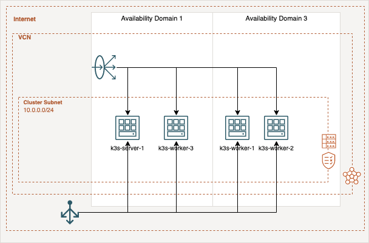

# Free K3s Cluster on the Oracle Cloud Infrastructure

The motivation of this project is to provide a K3s cluster with four nodes fully automatically, which is composed only of always free infrastructure resources. The deployment will be done Terraform and the user-data scripts which installs K3s automatically and build up the cluster.

## Architecture
The cluster infrastructure based on four nodes, two server- and two agent-nodes for your workload. A load balancer which is distributes the traffic to your nodes on port 443. The server-nodes are at the availability domain 2 (AD-2) and the agent node are created in AD-1. The cluster use the storage solution [Longhorn](https://longhorn.io), which will use the block storages of the OCI instances and shares the Kubernetes volumes between them. The following diagram give an overview of the infrastructure.
<p align="center">
    
</p>

## Configuration
First of all, you need to setup some environment variables which are needed by the OCI Terraform provider. The [Oracle Cloud Infrastructure documentation](https://docs.oracle.com/en-us/iaas/developer-tutorials/tutorials/tf-provider/01-summary.htm) gives a good overview of where the IDs and information are located and also explains how to set up Terraform. 
```
export TF_VAR_compartment_id="<COMPARTMENT_ID>"
export TF_VAR_region="<REGION_NAME>"
export TF_VAR_tenancy_ocid="<TENANCY_OICD>"
export TF_VAR_user_ocid="<USER_OICD>"
export TF_VAR_fingerprint="<RSA_FINGERPRINT>"
export TF_VAR_private_key="<PRIVATE_KEY>"
export TF_VAR_ssh_authorized_keys='["<SSH_PUBLIC_KEY>"]'
```

## Deployment
The deployment is a straight forwards process. First, start with a Terraform init:
```
terraform init
```
Second, you have to create a Terraform plan by this command:
```
terraform plan -out .tfplan
```
And last apply the plan:
```
terraform apply ".tfplan"
```

After a couple minutes the OCI instances are created and the Cluster is up and running. And are able to connect via SSH to your Server-node-1 to get the kube-config.
```
scp rancher@<SERVER_NODE_1_PUBLIC_IP>:/etc/rancher/k3s/k3s.yaml ~/.kube/config
```

Now you can use ```kubectl``` to manage your cluster and check the nodes:
```
kubectl get nodes
```

## Longhorn Installation
Finally, you have to deploy [Longhorn](https://longhorn.io) the distributed block storage by the following commands of the ```kubectl``` or ```helm``` method:

Method 1 by ```kubectl```:
```
kubectl apply -f https://raw.githubusercontent.com/longhorn/longhorn/v1.2.3/deploy/longhorn.yaml
```

Method 2 by ```helm```:
You can find a shell script with all commands in the ```services``` folder which run all the following commands at once.
```
helm repo add longhorn https://charts.longhorn.io
helm repo update
kubectl create namespace longhorn-system
helm install longhorn longhorn/longhorn --namespace longhorn-system
```

Additionally, for both methods you have to remove local-path as default provisioner and set Longhorn as default:
``` 
kubectl patch storageclass local-path -p '{"metadata": {"annotations":{"storageclass.kubernetes.io/is-default-class":"false"}}}'
kubectl patch storageclass longhorn -p '{"metadata": {"annotations":{"storageclass.kubernetes.io/is-default-class":"true"}}}'
```

Check the Longhorn ```storageclass```:
```
kubectl get storageclass
```

After a some minutes all pods are in the running state and you can connect to the Longhorn UI by forwarding the port to your machine:
```
kubectl port-forward deployment/longhorn-ui 8000:8000 -n longhorn-system
```

Use this URL to access the interface: ```http://127.0.0.1:8000``` .

## Automatically certificate creation via Let's Encrypt
For propagating your services, it is strongly recommended to use SSL encryption. In this case you have to deploy certificates for all of your services which should be reachable at the internet. To fulfill this requirement you can use the [```cert-manager```](https://cert-manager.io/) deployment in the ```services\cert-manager``` folder.

First, you have to execute the ```cert-manager.sh``` or the following commands:
```
helm repo add jetstack https://charts.jetstack.io
helm repo update

helm install \
  cert-manager jetstack/cert-manager \
  --namespace cert-manager \
  --create-namespace \
  --version v1.7.1 \
  --set installCRDs=true
```

Second, add a cluster issuer by editing and deploy ```cluster_issuer.yaml```file by replacing it with your email address  and your domain:
```
...
spec:
  acme:
    email: <your_email>@<your-domain>.<tld> # replace
...
```

Finally, when you deploy a service you have to add an ingress resource. You can use the example file ```ingress_example.yaml``` and edit it for your service:
```
...
spec:
  rules:
  - host: <subdomain>.<your-domain>.<tld>                # replace
    http:
      paths:
      - path: /
        backend:
          serviceName: <service-name>                    # replace
          servicePort: 80
  tls:
  - hosts:
    - <subdomain>.<your-domain>.<tld>                    # replace
    secretName: <subdomain>-<your-domain>-<tld>-prod-tls # replace
...
```

The last step needs to be done for every service. In this deployment step the cert-manager will handle the communication to Let's Encrypt and add the certificate to your service ingress resource.
## To Do's
- Terraform Load Balancer deployment
